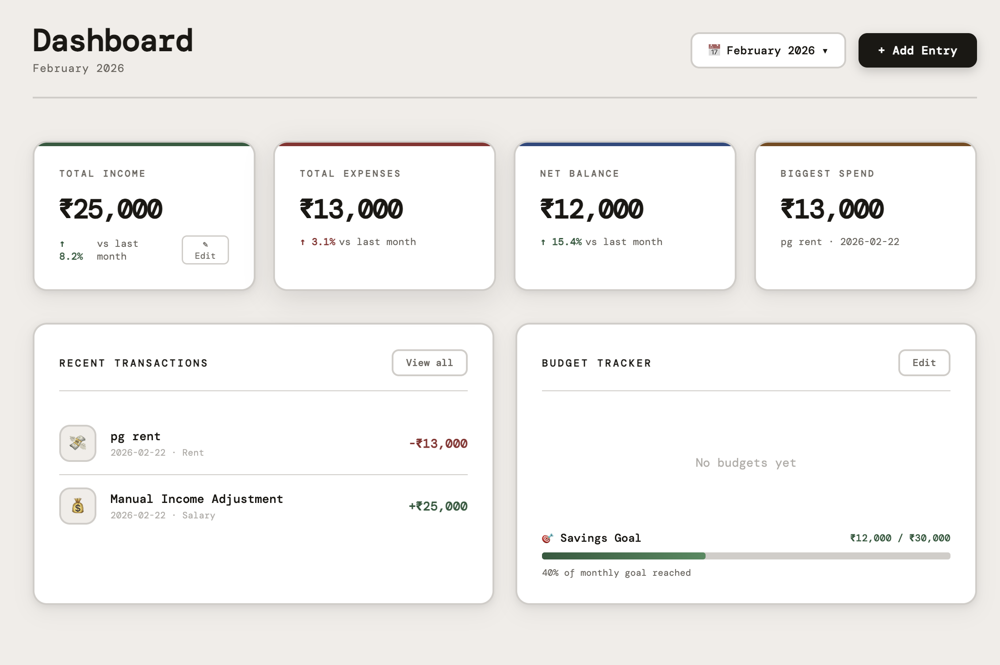
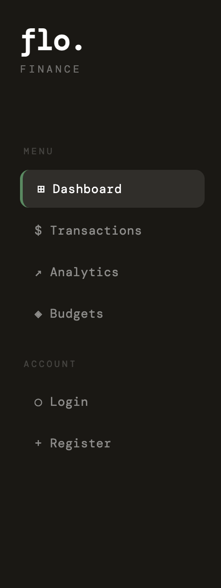

# flo. — Personal Finance Manager

A modern, minimal personal finance dashboard built with Angular and Supabase.

🔗 **Live Demo:** [https://finance-flame-sigma.vercel.app/dashboard]

---

## Features

- 📊 **Dashboard** — Real-time income, expense and balance tracking
- 💸 **Transactions** — Add, search, filter and delete transactions
- 📈 **Analytics** — Visual charts for spending trends and category breakdown
- 💰 **Budgets** — Set monthly budget limits and track spending per category
- 👤 **Profile** — User account and financial summary
- ☁️ **Cloud Database** — Powered by Supabase (PostgreSQL)
- 🎬 **Splash Screen** — Animated intro on app load

---

## Tech Stack

| Layer | Technology |
|---|---|
| Frontend | Angular 17+ |
| Styling | CSS with CSS Variables |
| Database | Supabase (PostgreSQL) |
| Charts | Chart.js |
| Deployment | Vercel |

---
## Screenshots

### Dashboard


### Sidebar


## Demo

### Adding a Transaction


---------

## Getting Started

### Prerequisites
- Node.js 18+
- Angular CLI

### Installation
```bash
git clone https://github.com/Ritviksingh-cyber/flo-finance.git
cd flo-finance
npm install
ng serve
```

Open `http://localhost:4200`

---

## Project Structure
```
src/app/
├── core/
│   ├── services/
│   │   └── expense.service.ts
│   └── supabase.ts
├── features/
│   ├── dashboard/
│   ├── transactions/
│   ├── analytics/
│   ├── budgets/
│   └── profile/
├── app.ts
├── app.html
└── app.routes.ts
```

---

## Screenshots

> Dashboard, Transactions, Analytics, Budgets pages

---

## Author

**Ritvik Singh**
- GitHub: [@Ritviksingh-cyber](https://github.com/Ritviksingh-cyber)

---

## License

MIT
