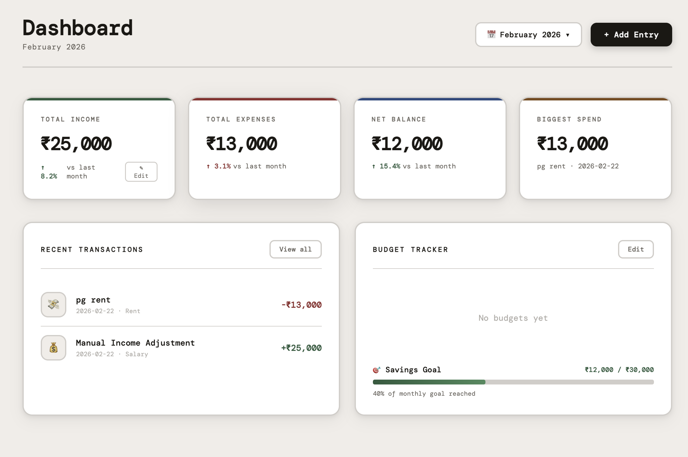

```markdown
# 
```
```
  ███████╗██╗      ██████╗      
  ██╔════╝██║     ██╔═══██╗     
  █████╗  ██║     ██║   ██║     
  ██╔══╝  ██║     ██║   ██║     
  ██║     ███████╗╚██████╔╝     
  ╚═╝     ╚══════╝ ╚═════╝  ·  
  Personal Finance Manager
```

> Track income, expenses and budgets — all in one clean dashboard.

🔗 **Live Demo:** [finance-flame-sigma.vercel.app](https://finance-flame-sigma.vercel.app/dashboard)

---

<div align="center">


**[🚀 Live Demo](https://finance-flame-sigma.vercel.app/dashboard)**

</div>

---

## What is flo.?

A clean, minimal personal finance manager that helps you track income, expenses and budgets — all in one place. Built as a full-stack project with Angular on the frontend and Django REST Framework on the backend.

---

## Features

```
💰  Income & expense tracking in real time
📊  Visual analytics with spending breakdowns  
🎯  Monthly budget limits with progress tracking
💸  Transaction history with search and filters
👤  User profile and financial summary
☁️  Cloud sync — data persists across devices
🎬  Animated splash screen on load
```

---

## Tech Stack

```
┌─────────────┬──────────────────────────────┐
│ Layer       │ Technology                   │
├─────────────┼──────────────────────────────┤
│ Frontend    │ Angular 17+ (standalone)     │
│ Backend     │ Django + Django REST          │
│ Auth        │ JWT (SimpleJWT)              │
│ Database    │ SQLite → PostgreSQL ready    │
│ Charts      │ Chart.js                     │
│ Styling     │ CSS with CSS Variables       │
│ Deployment  │ Vercel (frontend)            │
└─────────────┴──────────────────────────────┘
```

---

## Project Structure

```
flo-finance/
│
├── src/                          # Angular frontend
│   └── app/
│       ├── core/
│       │   ├── services/
│       │   │   ├── auth.service.ts
│       │   │   └── expense.service.ts
│       │   ├── guards/
│       │   │   └── auth.guard.ts
│       │   └── auth.interceptor.ts
│       ├── features/
│       │   ├── dashboard/
│       │   ├── transactions/
│       │   ├── analytics/
│       │   ├── budgets/
│       │   └── profile/
│       ├── app.routes.ts
│       └── app.config.ts
│
└── flo-backend/                  # Django backend
    ├── flo/
    │   ├── settings.py
    │   └── urls.py
    └── finance/
        ├── models.py
        ├── serializers.py
        ├── views.py
        └── urls.py
```

---

## Getting Started

### Prerequisites

```
Node.js 18+
Python 3.10+
Angular CLI
```

### Frontend

```bash
git clone https://github.com/Ritviksingh-cyber/flo-finance.git
cd flo-finance
npm install
ng serve
```

### Backend

```bash
cd flo-backend
python -m venv venv
source venv/bin/activate
pip install -r requirements.txt
python manage.py migrate
python manage.py runserver
```

Open `http://localhost:4200`

---

## API Endpoints

```
POST   /api/auth/register/       Register new user
POST   /api/auth/login/          Login → returns JWT
POST   /api/auth/refresh/        Refresh access token
GET    /api/auth/me/             Get current user

GET    /api/transactions/        List transactions
POST   /api/transactions/        Add transaction
DELETE /api/transactions/:id/    Delete transaction

GET    /api/budgets/             List budgets
POST   /api/budgets/             Add budget
PATCH  /api/budgets/:id/         Update budget
DELETE /api/budgets/:id/         Delete budget

GET    /api/analytics/           Spending analytics
```

---

## Screenshots

### Dashboard


### Adding a Transaction


---

## Author

```
╔══════════════════════════════╗
║   Ritvik Singh               ║
║   AI/ML • Full Stack Dev     ║
║   github.com/Ritviksingh-cyber║
╚══════════════════════════════╝
```

---


